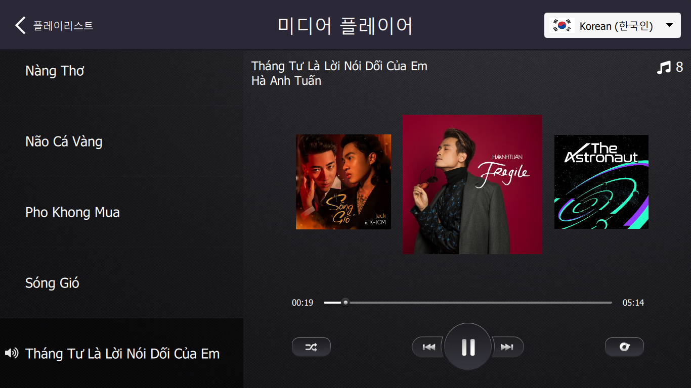
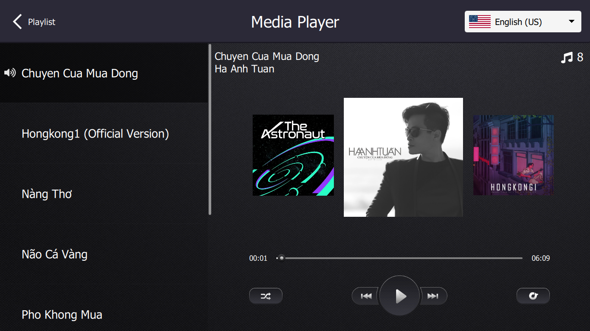
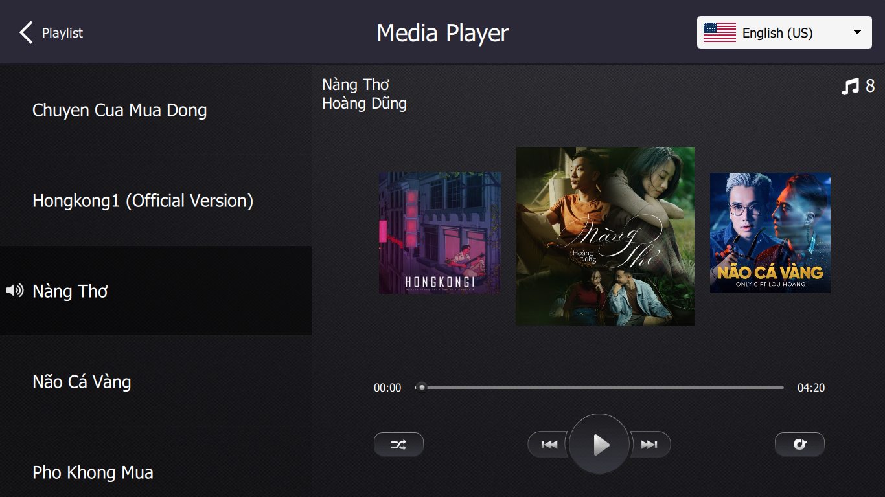
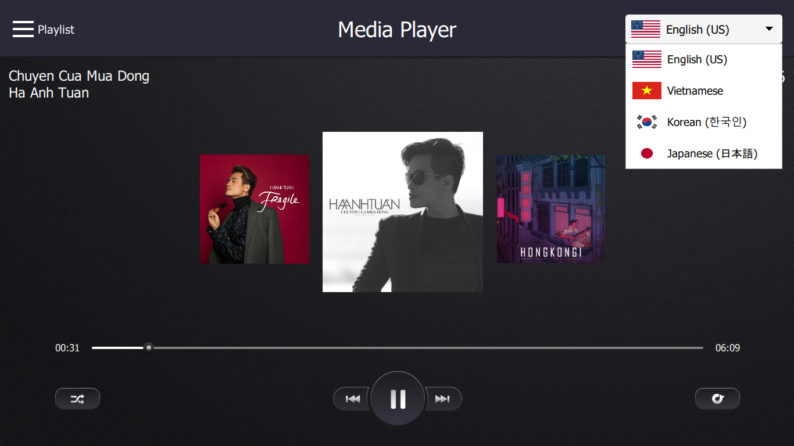
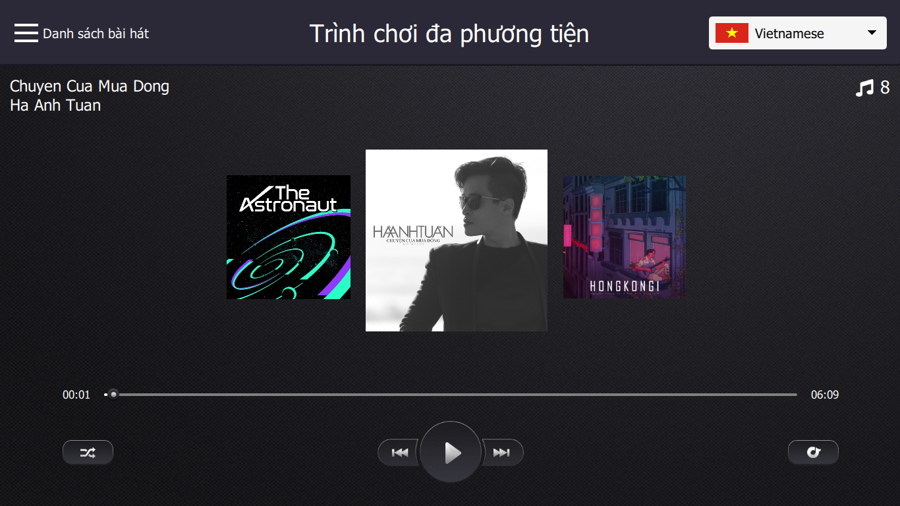
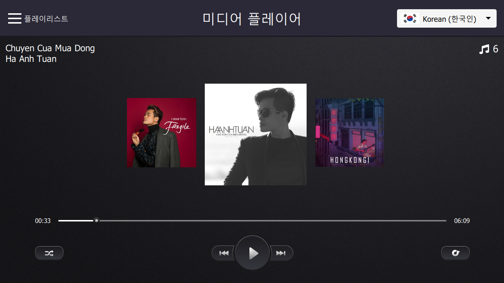
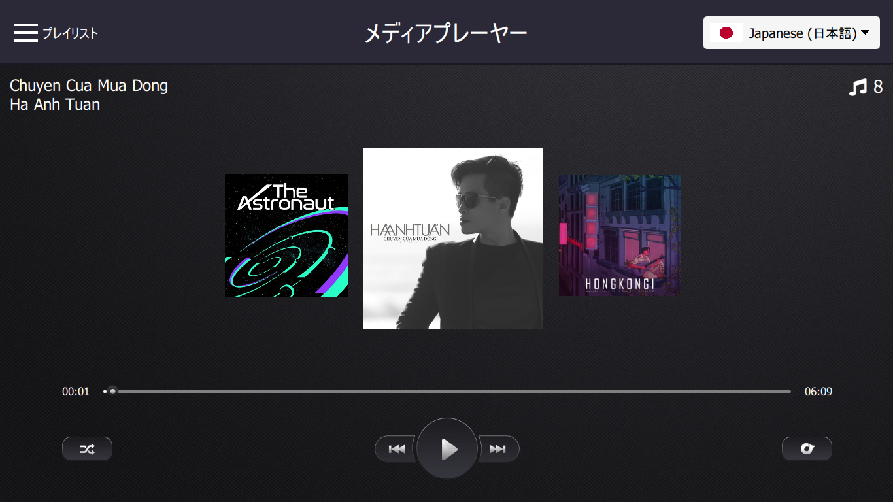

# PROJECT: MediaPlayer Application

- Project này sẽ thực hiện các chức năng chơi nhạc để mô phỏng hệ thống giải trí trên ô tô
  

### Thông tin về source code:

- Viết bằng ngôn ngữ Qt/QML và C++
- Version Qt 5.14.2 và Qt Creator 4.11.1 
- Build trên Ubuntu 22.04 

### Project bao gồm các kiến thức đã sử dụng như:

- Sử dụng mô hình Model View của Qt 
- Sử dụng ListView, PathView, ListModel
- Cách giao tiếp giữa C++ và QML
- Sử dụng đối tượng QMediaPlayer để thực hiện các chức năng chơi nhạc
- Làm việc với thư viện bên thứ ba: Taglib
- Xây dựng model bằng QAbstractListModel
- Sử dụng đối tượng Drawer của Qt Quick Control để hiển thị danh sách bài hát
- Sử dụng ComboBox của Qt Quick Control để lựa chọn ngôn ngữ
- Hỗ trợ đa ngôn ngữ cho ứng dụng Qt bằng QTranslation

## Cấu trúc chương trình: 
- 

## Chức năng:
- Phát nhạc và dừng nhạc
- Chuyển tiếp bài hát
- Chức năng phát ngẫu nhiên - shuffle
- Chức năng lặp lại bài hát hiện tại - repeat
- Chức năng hiển thị đóng, mở danh sách bài hát
- Chức năng lựa chọn và hiển thị đa ngôn ngữ: Anh, Việt, Hàn, Nhật

### 1. Giao diện ứng dụng:
- Giao diện hiển thị ban đầu sẽ không hiển thị danh sách bài hát:
  

### 2. Chức năng hiển thị đóng, mở danh sách bài hát:
- Hiển thị danh sách bài hát:

  
- Lựa chọn bài hát trên danh sách bài hát:

### 3. Chức năng lựa chọn và hiển thị đa ngôn ngữ: 
- Lựa chọn các ngôn ngữ trong ứng dụng:
    

- Lựa chọn tiếng Việt:
  

- Lựa chọn tiếng Hàn:
  

- Lựa chọn tiếng Nhật:
  

